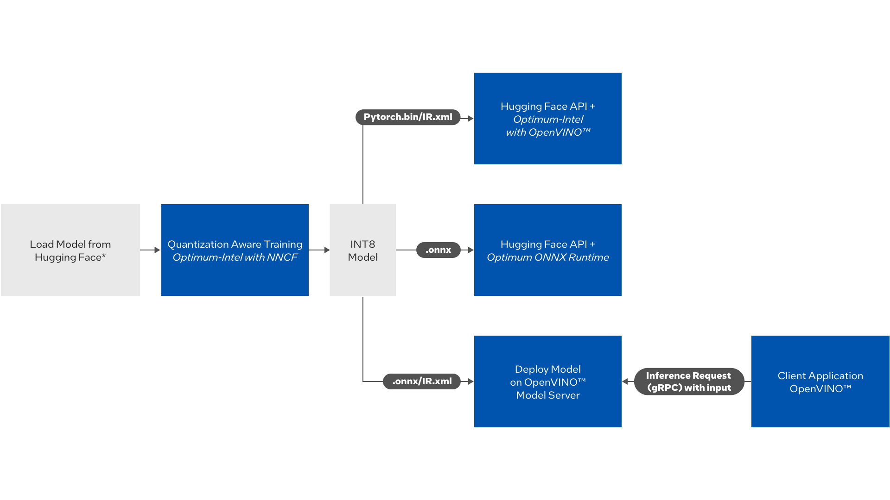

# An End-to-End NLP workflow with Quantization Aware Training(QAT) using Neural Networks Compression Framework (NNCF), and Inference using OpenVINO™ & OpenVINO™ Execution Provider through Optimum Library
This document details instructions on how to run quantization aware training & inference pipeline with Helm and docker.
 *	Introduction
    *	[Description](#Description)
    *	[Block Diagram](#block-diagram)
    *	[Project Structure](#project-structure)
    * [Prerequisites](#prerequisites)
      *	[Hardware](#hardware)
      * [Software](#software)
      *	[Cloning the repository](#download-source-code)      
  *	Get Started
    *	[QAT – Parameters to be modified](#modify-helmchartqatvaluesyaml)
    *	Options to execute the workflow
        *	Using Helm 
            *	[Steps to use the Helm chart](#helm-usage)
            *	[Use Case 1: Quantization Aware Training with Inference using Optimum-Intel*](#usecase-1-qat-with-inference-using-optimum-intel)
            *	[Use Case 2: Quantization Aware Training with Inference using OpenVINO™ Model Server](#usecase-2-qat-with-inference-using-OpenVINO™-model-server)
            *	[Use Case 3: Quantization Aware Training with Inference using Optimum Onnxruntime OpenVINO™ Execution Provider](#usecase-3-qat-with-inference-using-optimum-onnx-runtime-with-openvino-execution-provider)
            *	[Use Case 4: Only Inference](#usecase-4-inference-only)
            *	[Clean up](#Cleaning-up-resources)
            * [Output](#evaluate-use-case-output)
        *	Local Build instructions using Docker run
            *	[Quantization Aware Training](https://github.com/intel/nlp-training-and-inference-openvino/tree/main/question-answering-bert-qat/quantization_aware_training/README.md) 
            *	[Inference using Optimum-Intel*](https://github.com/intel/nlp-training-and-inference-openvino/tree/main/question-answering-bert-qat/openvino_optimum_inference/README.md)
            * [Inference using OpenVINO™ Model Server](https://github.com/intel/nlp-training-and-inference-openvino/tree/main/question-answering-bert-qat/openvino_inference/README.md)
            *	[Inference using Optimum Onnxruntime OpenVINO™ Execution Provider](https://github.com/intel/nlp-training-and-inference-openvino/tree/main/question-answering-bert-qat/onnxovep_optimum_inference/README.md)
            *	[Clean up](https://docs.docker.com/engine/reference/commandline/rm/)
    * Optional: 
        * [Set Up Azure Storage](#set-up-azure-storage)
        * [Enable NVIDIA GPU for training](https://github.com/intel/nlp-training-and-inference-openvino/tree/main/question-answering-bert-qat/docs/gpu_instructions.md)
    * [References](#references)
    *	[Troubleshooting](#Troubleshooting)
    
## Description
The main objective of this automated AI/ML pipeline is to demonstrate quantization aware training using Neural Networks Compression Framework(NNCF) through Optimum-Intel* and deployment of inference application through various APIs i.e., Hugging Face API, ONNX Runtime API and OpenVINO™ Model Server

## Block Diagram
  



This workflow is stitched together and deployed through Helm by using microservices/docker images which can be built.

The workflow executes as follows
1) The Pipeline triggers Quantization Aware Training of an NLP model from Hugging Face. The output of this container is the INT8 optimized model stored on a local/cloud storage.
2) Once the model is generated, then inference applications can be deployed with one of the following APIs  
   i) Inference using Hugging Face APIs + Optimum-Intel with OpenVINO™   
  ii) Deploy the model using OpenVINO™ Model Server and send in grpc requests  
 iii) Inference using Hugging Face APIs + Optimum ONNX Runtime with OpenVINO™ Execution Provider  

## Project Structure 
```
├──quantization_aware_training - Training related scripts
├──openvino_optimum_inference - Hugging Face API inference with Optimum Intel
├──onnxovep_optimum_inference - Hugging Face API with Optimum Onnxruntime OpenVINO™ Execution Provider
├──openvino_inference - Inference using OpenVINO™ Model Server
├── helmchart
 ├── deployment_yaml
   ├──deployment_onnx.yaml - Deploys optimum onnxruntime inference container
   ├──deployment_ovms.yaml - Deploys optimized model through OpenVINO™ Model Server
 ├── qat
  ├── charts
  ├── templates
   ├──pre_install_job.yaml - Deploys Quantization Aware Training container
   ├──deployment_optimum.yaml - Deploys Huggingface API inference container with Optimum Intel
 ├── chart.yaml
 ├── values.yaml
 └── README.md
```
## Prerequisites 

- Kubernetes cluster that has comparable configurations as follows

## Hardware
### Edge Nodes

-   One of the following System:

    -   Intel(R) Xeon(R) Platinum 8370C CPU @ 2.80GHz (16 vCPUs)
       
       -   At least 64 GB RAM.
.
    -   Intel(R) Xeon(R) with NVIDIA* GPU.
      
       -   At least 112 GB RAM.  

-   At least 256 GB hard drive.

-   An Internet connection.

-   Ubuntu\* 20.04 LTS
    
## Software

- Docker & Docker Compose installation [here](https://docs.docker.com/engine/install/ubuntu/)
   
- Any flavor of kuberentes variations.

  We have used rancher k3s installation. Further details in [here](https://rancher.com/docs/k3s/latest/en/installation/install-options/#options-for-installation-with-script)
  ```
  curl -sfL https://get.k3s.io | sh -s - --write-kubeconfig-mode 644
  export KUBECONFIG=/etc/rancher/k3s/k3s.yaml
  ```
- Helm installation on master node. 

  Steps to install as below. For further details please refer [here](https://helm.sh/docs/intro/install/)
   ```
   curl -fsSL -o get_helm.sh https://raw.githubusercontent.com/helm/helm/main/scripts/get-helm-3
   chmod 700 get_helm.sh
   ./get_helm.sh
   ```
- We are currently using  `bert-large-uncased-whole-word-masking-finetuned-squad`
 model for `Question Answering` usecase through quantization aware training and inference . We do have training and inference scripts in the respective folders.

- For training on GPU, please refer instructions on [Enable NVIDIA GPU for training](https://github.com/intel/nlp-training-and-inference-openvino/tree/main/question-answering-bert-qat/docs/gpu_instructions.md)
## Install and Run the workflow:
## Download source code

```
git clone  https://github.com/intel/nlp-training-and-inference-openvino.git

cd nlp-training-and-inference-openvino/question-answering-bert-qat
```
## Modify helmchart/qat/values.yaml
  * Replace <current_working_gitfolder> under 'mountpath:' with the current working repo directory. 
### **Note:**  
  Relative paths do not work with Helm.
  * Edit the `helmchart/qat/values.yaml` file for the <train_node> and <inference_node> values under 'nodeselector' key  
    Pick any of the available nodes for training and inference with the nodename of this command.
    ``` 
    kubectl get nodes --show-labels
    ```
    nodeselector:  
      trainingnode: <train_node>  
      inferencenode: <inference_node>

   
  * Edit `helmchart/qat/values.yaml` file with higher values of MAX_TRAIN_SAMPLES and MAX_EVAL_SAMPLES parameters for better finetuning of data. Default value is 50 samples.
  * More details on all the parameters in [here](https://github.com/intel/nlp-training-and-inference-openvino/tree/main/question-answering-bert-qat/docs/params_table.md)
   
## Helm Usage
This section contains step-by-step details to install specific Helm charts with both training and inference. [Learn more about Helm commands.](https://helm.sh/docs/helm/helm_install/)
   
 
### Usecase 1: QAT with Inference using Optimum Intel.  
  We have options to run inference on two ways  
  1. Using Input CSV file( Default behaviour)  
  2. Using Arguments(Optional) - Question and Context Argument. We need to edit `deployment_optimum.yaml` to run inference based on question and context argument. We need to pass question and context as below in `deployment_optimum.yaml`:  
  `args: ["-c", "chown openvino -R /home/inference && cd /home/inference && ./run_onnx_inference.sh 'Who is sachin' 'Sachin is a cricket player'"]`


   Training pod is deployed through `pre_install_job.yaml`.
   Inference pod is deployed through `deployment_optimum.yaml`.

  
   ```
   cd helmchart
   helm install qatchart qat  --timeout <time>
   ```
  The `<time>` value has the format ``nnns``, where **s** indicates seconds. For the above hardware configuration and with ``MAX_TRAIN_SAMPLES=50``, we recommend you set the `<time>` value as ``480s``. You can increase the value for reduced hardware configuration. Refer to [Troubleshooting](#Troubleshooting) in case of timeout errors.

  Confirm if the training has been deployed.

   ```
   kubectl get pods
   ```
  
  If the training pod is in "Running" state then the pod has been deployed. Otherwise, check for any errors by running the command 
  
  ```
  kubectl describe pod <pod_name>
  ```
  
  The training pod will be in "Completed" state after it finishes training. Refer to [Training Output section](#training-output) for details.
  
  Once the training is completed, inference pod gets deployed automatically. Inference pod uses OpenVINO™ Runtime as backend to Hugging Face APIs and takes in model generated from training pod as input.  Refer to [Inference Output section](#inference-output) for details.
   

### Usecase 2: QAT with Inference using OpenVINO™ Model Server
   
  The Training pod is deployed through `pre_install_job.yaml`.
  The OpenVINO™ Model Server pod is deployed through `deployment_ovms.yaml`.

   Copy `deployment_ovms.yaml` from `helmchart/deployment_yaml` folder into `helmchart/qat/templates`. Make sure there is only one deployment_*.yaml file in the templates folder for single deployment. 
   
   Follow same instructions as [Usecase1](#usecase-1)
  
  #### OpenVINO™ Model Server Inference output
  1. OpenVINO™ Model Server deploys optimized model from training container. View the logs using the command:
    ```
    kubectl logs <pod_name>
    ```
   Now the pod is ready to accept client requests
  
  2. The client can send in grpc request to server using OpenVINO APIs. For more details on the OpenVINO™ Model Server Adapter API [here](https://docs.openvino.ai/latest/omz_model_api_ovms_adapter.html).
  3. Run a sample OpenVINO client application as below. 
  
     Open a new terminal to run the client application. Change the  'hostname' in the command below before running
 
   'hostname' : hostname of the node where the OpenVINO™ Model Server has been deployed.  
 ```
 kubectl get nodes  
     
 azureuser@SRDev:~/nlp-training-and-inference-openvino/question-answering-bert-qat/openvino_optimum_inference$ kubectl get nodes  
 NAME    STATUS   ROLES                  AGE   VERSION  
 srdev   Ready    control-plane,master   16d   v1.24.6+k3s1   
 ```
 
   In this case, hostname should be srdev
 #### Run client application to send request to OpenVINO™ Model Server
  This will download inference script from open_model_zoo and serve inference using ovms server.
    
```
cd <gitrepofolder>/openvino_inference
docker run -it --entrypoint /bin/bash -v "$(pwd)":/home/inference -v "$(pwd)"/../quantization_aware_training/models/bert_int8/vocab.txt:/home/inference/vocab.txt --env VOCAB_FILE=/home/inference/vocab.txt --env  INPUT="https://en.wikipedia.org/wiki/Bert_(Sesame_Street)" --env MODEL_PATH=<hostname>:9000/models/bert openvino/ubuntu20_dev:2022.2.0  -c /home/inference/run_ov_client.sh
```
   
   The client application will trigger a interactive terminal to ask questions based on the context for "https://en.wikipedia.org/wiki/Bert_(Sesame_Street)" as this is given as input. Please input a question.
   

  ### Usecase 3: QAT with Inference using Optimum ONNX Runtime with OpenVINO™ Execution Provider
  
  The Training pod is deployed through `pre_install_job.yaml`.
  The Optimum ONNX Runtime with OpenVINO™ Execution Provider pod is deployed through `deployment_onnx.yaml`. 

   Copy `deployment_onnx.yaml` from `helmchart/deployment_yaml` folder into `helmchart/qat/templates`. Make sure there is only one deployment_*.yaml file in the templates folder.
   
   Follow same instructions as [Usecase1](#usecase-1)
   

### Usecase 4: Inference Only  

 Before triggering the inference, make sure you have access to the model file and also edit the model path in the `qat/values.yaml` file.
 Keep only one deployment-*.yaml file in the `qat/templates` folder to deploy
just one inference application.

*  For Huggingface API  with Optimum Intel, use `deployment_optimum.yaml`.
   Model format acceptable is pytorch or IR.xml

*  For OpenVINO™ model server, use `deployment-ovms.yaml`. Model format
   acceptable is IR.xml

*  For Optimum Onnxruntime with OpenVINO-EP, use `deployment_onnx.yaml` file. Model
   format acceptable is .onnx
```
cd helmchart
helm install qatchart qat --no-hooks
```

### Evaluate Use Case Output

View the pods that are deployed through Helm Chart with the command below:

   ```
   kubectl get pods
   ```
Take the pod_name from the list of pods
        
   ```
   kubectl logs <pod_name>
   ```
    
 If the pods are in completed state, it means they have completed the running task. 
 
### Training output

 1. Output of the training container will be an optimized INT8 model generated in the quantization_aware_training/model folder.
 2. Verify if all the model files are generated in the <output> folder.
 3. A logs.txt file is generated to store the logs of the training container which will have accuracy details

### Inference Output

 1. Input to the inference pod will be taken from *_inference/data folder
 2. Output of the inference pod will be stored in the *_inference/logs.txt file. 
 3. View the logs using 
    ```
    kubectl logs <pod_name>
    ```

## Optional or Additional Steps:
### Steps to skip training and deploy inference applications:
Before triggering the inference, make sure you have access to the model file and also edit the model path in the `qat/values.yaml` file
   ```
   helm install qatchart qat --no-hooks
   ``` 
	
Cleanup resources: 
	
   ```	  
   helm uninstall qatchart
   ```
### Steps to trigger just inference application:
Before triggering the inference, make sure you have access to the model file and also edit the model path in the `qat/values.yaml` file

Keep only one deployment-*.yaml file in the qat/templates folder to deploy just one inference application.

1) For Optimum Onnxruntime with OpenVINO-EP, use `deployment_onnx.yaml` file. Model format acceptable is .onnx
2) For Huggingface API  with OpenVINO™ runtime, use `deployment_optimum.yaml`. Model format acceptable is pytorch or IR.xml
3) For OpenVINO™ Model Server, use `deployment-ovms.yaml`. Model format acceptabe is IR.xml


   ```
   helm install qatchart qat --no-hooks
   ``` 
Cleanup resources: 
	
   ```	  
   helm uninstall qatchart
   ```
## Set Up Azure Storage

This is an optional step. Use Azure Storage for multi node kubernetes setup if you want to use the same storage across all the nodes.

### Azure References
  * [Azure File Storage](https://docs.microsoft.com/en-us/previous-versions/azure/virtual-machines/linux/mount-azure-file-storage-on-linux-using-smb)
### Setup Steps
  * Open Azure CLI terminal on Azure Portal 
  * Create a resource group
  ```
  az group create --name myResourceGroup --location eastus
  ```
  * Create Storage Account
  ```
  STORAGEACCT=$(az storage account create \
  --resource-group "myResourceGroup" \
  --name "mystorageacct$RANDOM" \
  --location eastus \
  --sku Standard_LRS \
  --query "name" | tr -d '"')
  ```
  * Create Storage Key
  ```
  STORAGEKEY=$(az storage account keys list \
  --resource-group "myResourceGroup" \
  --account-name $STORAGEACCT \
  --query "[0].value" | tr -d '"')
  ```
  * Create a file share
  ```
  az storage share create --name myshare \
  --quota 10 \
  --account-name $STORAGEACCT \
  --account-key $STORAGEKEY
  ```
  * Create a mount point
  ```
  mkdir -p /mnt/MyAzureFileShare
  ```
  * Mount the share
  ```
  sudo mount -t cifs //$STORAGEACCT.file.core.windows.net/myshare /mnt/MyAzureFileShare -o vers=3.0,username=$STORAGEACCT,password=$STORAGEKEY,serverino
  ```
  * Note
  ```
     We can also create mount point and mount the share by proceeding following steps - Go to created File share in Azure Portal and click connect. It will provide steps to connect the file share from a Linux,Windows and Macos.
  ```
  ### Usage of Azure Storage in helm
  * Clone the git_repo in /mnt/MyAzureFileShare and make it as your working directory
  * Edit <current_working_directory> in `./helmchart/qat/values.yaml` file to reflect the same
  * All other instructions will be same as in above steps to install the Helm chart and trigger the pipeline. 
  * Once the training is completed, you can view the Azure Portal and check in your fileshare that the model has been generated.

## References
* [OpenVINO™ Integration with Hugging Face- Optimum-Intel](https://github.com/huggingface/optimum-intel/tree/v1.5.2)
* [NNCF](https://github.com/AlexKoff88/nncf_pytorch/tree/ak/qdq_per_channel)
* [Huggingface Transformers training pipelines](https://github.com/huggingface/transformers/tree/main/examples/pytorch)
* [OpenVINO™ Execution Provider](https://onnxruntime.ai/docs/execution-providers/OpenVINO-ExecutionProvider.html)

## Troubleshooting

### Connection refused
If encounters connection refused as shown below

```
  Error: INSTALLATION FAILED: Kubernetes cluster unreachable: Get "http://localhost:8080/version": dial tcp 127.0.0.1:8080: connect: connection refused
```
Set the environment variable
```
   export KUBECONFIG=/etc/rancher/k3s/k3s.yaml
```

### Helm Installation Failed
If you see this error message:

 ```
   Error: INSTALLATION FAILED: cannot re-use a name that is still in use
 ```
Run the command:
```
   helm uninstall qatchart
``` 
Then install it again
```
   helm uninstall qatchart
```
### Helm timeout
 If the training is taking a long time, you may see a timeout error during helm install command, similar to the text below:
   ```
	Error: INSTALLATION FAILED: failed pre-install: timed out waiting for the condition
   ```
	
 #### Workaround 1
  Based on the system performance please add --timeout <seconds> to the helm command
  ```
    helm install qatchart qat --timeout <time>
  ```
  `time` value. For the above H/W configuration and with MAX_TRAINING_SAMPLES as 50 it would ideally be 480s. Please increase the timeout if need to finetune on whole dataset.
  
 #### Workaround 2
  1. Even if the helm an issues error, the training pod will get schedule and will keep running and finish its job. Verify using
	kubectl logs <training_pod>
      when the pod is completed.
  2. Run the command
	```
	   helm uninstall qatchart
	```
  3. Install the qatchart with just inference as training has completed
	```
	helm install qatchart qat --no-hooks
	```
 
### Useful commands:

Uninstalling helm: (If required)
```
sudo rm -rf /usr/local/bin/helm
```

Uninstalling k3s: (If required)
```
/usr/local/bin/k3s-uninstall.sh
```
[Read more here](https://rancher.com/docs/k3s/latest/en/installation/uninstall/#:~:text=If%20you%20installed%20K3s%20using,installation%20script%20with%20different%20flags) <br />

### Cleaning up resources

Remove the helm chart

```
helm uninstall qatchart
```
Delete any pods of jobs after the execution
```
kubectl delete pod <pod_name>
kubectl delete job <job_name>
```
	

